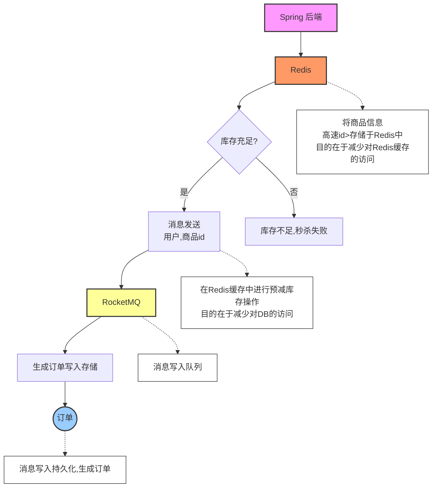

# 分布式秒杀商城系统

基于Spring Boot + Redis + RocketMQ + ElasticSearch + MinIO构建的高性能分布式秒杀商城系统。

## 功能特点

- 基于Redis的秒杀功能，解决高并发下的库存超卖问题
- MinIO对象存储，支持高性能的图片存储和访问
- RocketMQ消息队列，实现系统间解耦和异步处理
- ElasticSearch全文检索，提供强大的商品搜索功能
- 分布式Session管理，支持横向扩展
- 全局异常处理，规范化错误信息

## 技术栈

- **后端**：Spring Boot, Spring MVC, MyBatis
- **数据库**：MySQL
- **缓存**：Redis
- **搜索引擎**：ElasticSearch
- **消息队列**：RocketMQ
- **对象存储**：MinIO
- **工具库**：JWT, Lombok, Swagger

## 快速开始

### 环境要求

- Docker & Docker Compose
- JDK 11+
- Maven 3.6+

### 启动服务

1. 克隆代码仓库
```bash
git clone https://github.com/yourusername/distributed-shopping.git
cd distributed-shopping
```

2. 使用Docker Compose启动依赖服务
```bash
# 直接启动所有服务，无需创建额外目录
docker-compose up -d
```

3. 编译并运行项目
```bash
mvn clean package -DskipTests
java -jar target/distributed-shopping.jar
```

4. 访问API文档
```
http://localhost:8080/swagger-ui.html
```

### 服务列表及端口

- **应用服务**：8080
- **MySQL**：3306
- **Redis**：6379
- **ElasticSearch**：9200, 9300
- **RocketMQ NameServer**：9876
- **RocketMQ Broker**：10909, 10911
- **RocketMQ Dashboard**：8180
- **MinIO服务**：9000(API), 9001(Console)

## 文件存储功能使用

### 上传文件

```http
POST /file/v1/upload HTTP/1.1
Host: localhost:8080
Content-Type: multipart/form-data
```

参数:
- `file`: 要上传的文件 (必需)
- `bucketName`: 存储桶名称 (可选，默认值：seckill)

### 获取文件URL

```http
GET /file/v1/url?fileName=xxxxx&bucketName=seckill HTTP/1.1
Host: localhost:8080
```

参数:
- `fileName`: 文件名 (必需)
- `bucketName`: 存储桶名称 (可选，默认值：seckill)

### 删除文件

```http
DELETE /file/v1/delete?fileName=xxxxx&bucketName=seckill HTTP/1.1
Host: localhost:8080
```

参数:
- `fileName`: 文件名 (必需)
- `bucketName`: 存储桶名称 (可选，默认值：seckill)

## MinIO控制台

通过浏览器访问MinIO控制台，可以直观地管理文件：

```
http://localhost:9001
```

登录凭证：
- 用户名：minioadmin
- 密码：minioadmin

## 主要模块说明

- **用户认证模块**：实现用户登录、注册和会话管理
- **商品模块**：商品的CRUD操作和分类管理
- **订单模块**：订单创建、支付和流转
- **秒杀模块**：高性能的秒杀功能
- **搜索模块**：基于ES的商品搜索功能
- **文件存储模块**：基于MinIO的图片存储功能


## 基本秒杀思路


